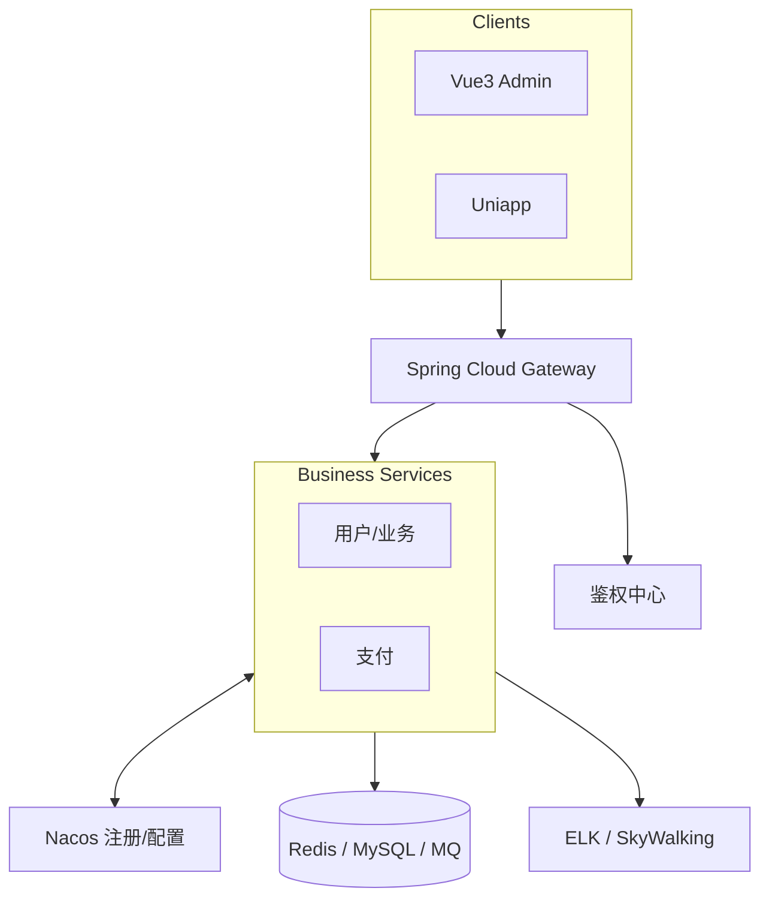

# nbwfw · NB 微服务全栈跟练仓

> 暑假主线：跟随 [小坏说 Java · NB 微服务全栈](https://ai.e404e.cn/course) 深度学习——把「听过名词」变成「能拉仓、联调、讲清链路」。

[](#tech-stack)
[](#tech-stack)
[](#tech-stack)
[](#roadmap)

<!-- 配图占位：出图后取消注释

-->

**导航：** [为什么](#why) · [能力层](#features) · [技术栈](#tech-stack) · [架构](#architecture) · [跟练主链路](#workflow) · [Preview](#preview) · [Showcase](#showcase) · [快速开始](#quickstart) · [仓库结构](#structure) · [路线图](#roadmap) · [文档](#docs)

---

<a id="why"></a>
## 为什么有这个仓

不是再收藏一门课，是把卡死你的几关打通：**环境、联调、支付、发布**。

| 报名前常见状态 | 跟完后要对齐的状态 |
|---|---|
| 教程收藏一堆，环境起不来 | 能独立拉起多模块工程 |
| JD 中间件只会背词 | 听得懂 Nacos / Gateway / 限流落点 |
| 支付 / 网关一联调就慌 | 会顺着日志排回调与状态 |
| 简历有项目、深问就穿 | 能把课内链路讲清楚 |

参考：

- 课程页：https://ai.e404e.cn/course
- B 站合集：https://space.bilibili.com/1914134970/channel/collectiondetail?sid=8087830
- 公开入口：https://www.bilibili.com/video/BV1RVyYBZE4z/

---

<a id="features"></a>
## 你会搭出什么

<!--  -->

| 层 | 内容 |
|---|---|
| 前端 / 移动端 | Vue3 中后台 · Uniapp 小程序 · H5 / App |
| 接入层 | Gateway · 鉴权中心 · 限流熔断 |
| 业务微服务 | Boot 多模块 · OpenFeign · 支付 / 用户 |
| 中间件 | Nacos · Redis · Seata / MQ |
| 可观测 & 发布 | ELK · SkyWalking · K8s / 流水线 |

---

<a id="tech-stack"></a>
## 技术栈

<!--  -->

| 层 | 选型 |
|---|---|
| 语言 / 构建 | Java 17+（本机 JDK 21）· Maven 多模块 |
| 后端协作 | Spring Boot 3 · Spring Cloud Alibaba · Nacos · Gateway · OpenFeign · Sentinel · Seata |
| 数据 | MySQL · MyBatis-Plus · Redis · RabbitMQ（按课扩展） |
| 前端 / 移动 | Vue3 · Vite · Element Plus · Uniapp · uView |
| 可观测 / 发布 | Actuator · ELK · SkyWalking · Docker · Harbor · K8s |

事实源：根目录 `CONTEXT.md`。

---

<a id="architecture"></a>
## 架构（课内拓扑）

<!--  -->



---

<a id="workflow"></a>
## 跟练主链路（入职 12 步）

<!--  -->

1. 工程起步 — JDK / Maven / 多模块 / Lombok  
2. 业务基本功 — Boot · MySQL · MyBatis-Plus · JWT · Knife4j  
3. 微服务协作 — Nacos · Feign · Gateway  
4. 中间件 — Redis · MQ · ES · OSS  
5. 稳定性 & 可观测 — Sentinel · ELK · SkyWalking  
6. 账号体系 — 微信多端授权  
7. 支付闭环 — 微信 + 支付宝  
8. 一致性 & Job — Seata · 定时任务  
9. 前后端交付 — Vue3 · Uniapp  
10. 业务实战 — 八卦 / 证件照  
11. 上线路径 — Docker · Harbor · K8s  
12. AI 加餐 — AI 服务模块  

---

<a id="preview"></a>
## Preview

本仓**不是**组件/模板资产库，**不单独建 Preview Gallery 站**。

本地只提供 **README 排版预览壳**（看 Markdown 渲染，不是业务产品站）：

```bash
# 在仓库根
python -m http.server 8090
# 浏览器打开
# http://127.0.0.1:8090/preview-readme.html
```

> 不要用 `file://` 双击打开（`fetch` README 会失败）。端口登记见 `docs/outputs/prd/port-registry.md`。

---

<a id="showcase"></a>
## Showcase

| 状态 | 说明 |
|---|---|
| 当前 | 仅 Agent / docs 骨架，**无可截产品 UI** |
| 计划 | 业务模块跑通后，用 Playwright 补 `assets/images/readme/showcase-*.png` |
| 推荐演示路径（占位） | 父工程启动 → Nacos 注册列表 → Gateway 路由 → 管理端登录页 |

---

<a id="quickstart"></a>
## 快速开始

### 环境（已在本机对齐）

| 项 | 期望 |
|---|---|
| JDK | 21（`.vscode/settings.json` 已指向本机路径） |
| Maven | 3.9+ |
| Cursor 扩展 | Java Pack · Spring Boot Pack（见 `.vscode/extensions.json`） |

### 读仓顺序

1. `CONTEXT.md` — 领域与硬约束  
2. `AGENTS.md` — Agent 门禁  
3. `README.md`（本文）— 人读路线  
4. 开业务前：`.scratch/<theme>/` Issue → `docs/outputs/prd/<theme>/prd.md` 批准  

### 当前不要做的事

- Gate 前不要写微服务业务代码  
- 不要把课程付费资料整包塞进仓库  

---

<a id="structure"></a>
## 仓库结构

```text
nbwfw/
├── AGENTS.md · CLAUDE.md · CONTEXT.md · LANGUAGES.md · README.md
├── .cursor/rules/          # Windows / 回答格式 / commit-history / 跟课与 Spring 规范
├── .vscode/                # JDK / Maven / 扩展推荐
├── docs/
│   ├── agents/             # workflow · issue-tracker · triage · voice …
│   ├── adr/                # ADR-0000 …
│   ├── knowledge/          # project-init 等可迁移知识
│   └── outputs/prd/        # port-registry · readme-diagrams
├── assets/images/readme/   # README 配图（待出图）
├── preview-readme.*        # README 本地预览壳 :8090
└── （未来）Maven 父工程 + 子模块   # 首个 theme 批准后再建
```

---

<a id="roadmap"></a>
## 路线图（视频大纲）

| 阶段 | 主题 |
|:---:|---|
| 01 | 微服务地基 |
| 02 | 限流 · 监控 · 可观测 |
| 03 | 微信与社交登录 |
| 04 | 微信支付全场景 |
| 05 | 分布式事务 & Job |
| 06 | Vue 管理端 + Uniapp |
| 07 | 实战：八卦 & 证件照 |
| 08 | Docker · Harbor · K8s |
| 09 | AI 智能体加餐 |

出图 Prompt：`docs/outputs/prd/readme-diagrams/readme-image-prompts.md`。

---

<a id="docs"></a>
## 文档

| 文档 | 用途 |
|---|---|
| [CONTEXT.md](./CONTEXT.md) | 领域事实 |
| [LANGUAGES.md](./LANGUAGES.md) | 共享用词 |
| [AGENTS.md](./AGENTS.md) | Agent 硬约束 |
| [docs/agents/workflow.md](./docs/agents/workflow.md) | 任务流 |
| [docs/adr/0000-adopt-adr.md](./docs/adr/0000-adopt-adr.md) | 采用 ADR |
| [assets/README.md](./assets/README.md) | 媒体约定 |

---

**Gate：** project-init Phase A/B 完成后，由小 A Review；通过后再开第一个业务 theme。
